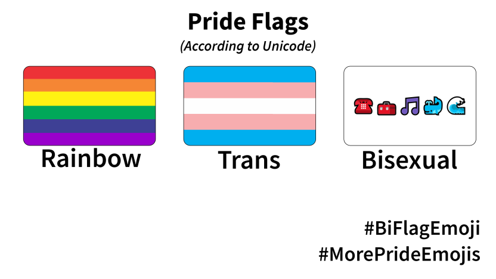
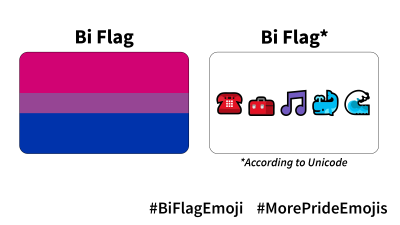
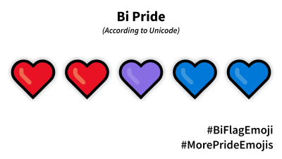
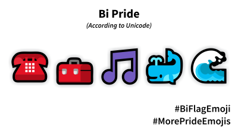

# #MorePrideEmojis

As it stands, pride emoji are severely lacking. There are only two options: 🏳️‍🌈 and 🏳️‍⚧️. This is not inclusive enough to represent the LGBTQIA+ community, a diverse peoople across the world. As such, we have started a campaign for a #BiFlagEmoji.

## #BiFlagEmoji: Over a year in the making

Over [a year ago](https://tannermarino.com/2020/bisexual-pride-flag-emoji-proposal/), our campaign proposal to Unicode was submitted and promptly rejected, without a reason. Who's Unicode, you ask? The Unicode Consortium sets the standard for how computers encode text, so that different systems and devices can work together. Their role also includes approving emoji proposals. Unfortunately, all requests for new emoji must go through them - and in cases like ours, sometimes they reject sensible proposals without a reason.

## How you can help

- Share the images on this page with your friends and on social media with #BiFlagEmoji
- Use our filters ([Insta](https://www.instagram.com/ar/827309184482321/)/[FB](https://www.facebook.com/fbcameraeffects/tryit/827309184482321/)) to promote #BiFlagEmoji on your story
- Sign the [petition](https://change.org/biflagemoji)!
- [Sign up](https://forms.gle/Tu7iHNTucw6rH4Tq6) to be updated on our progress or to help us with this campaign!

## What's next?

- In April, we will begin our campaign for the #AceFlagEmoji
