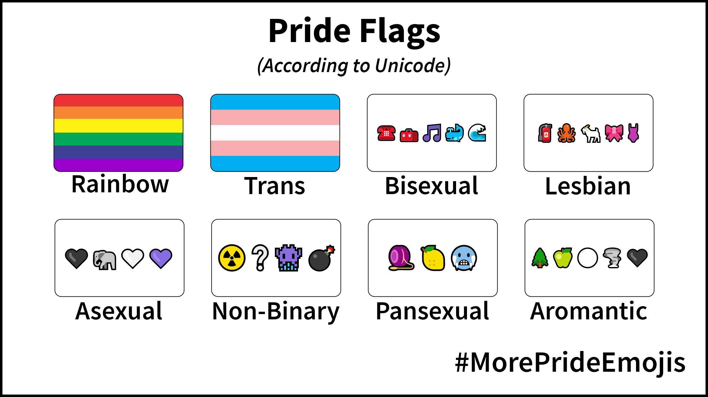
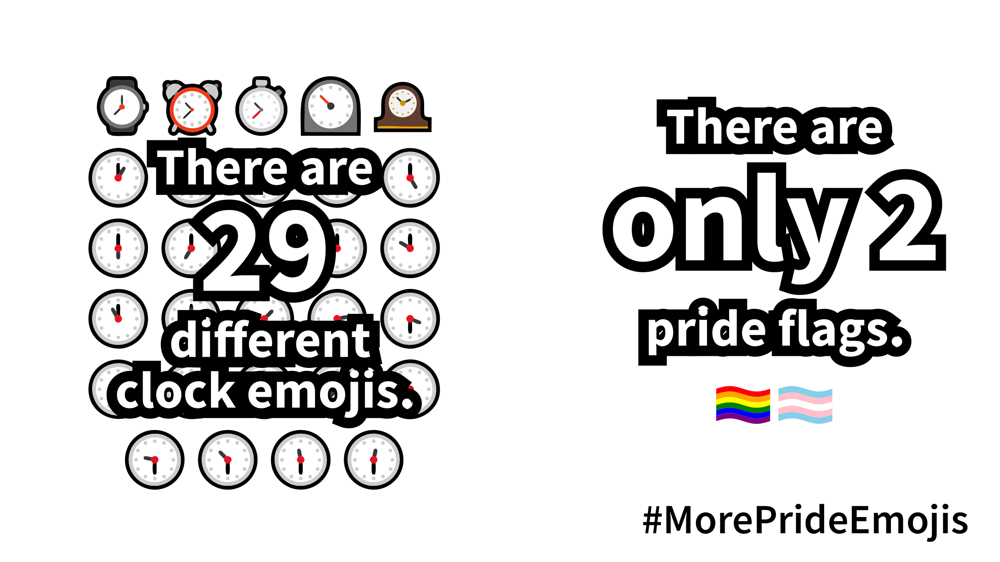
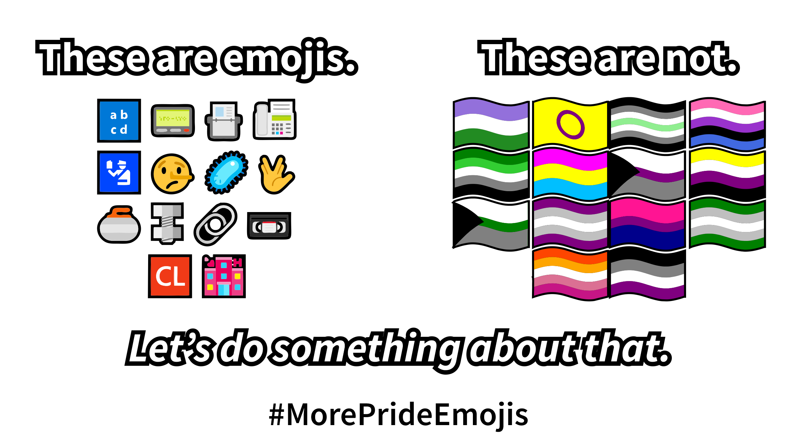
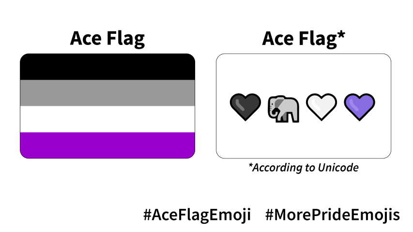

As it stands, pride emoji are severely lacking. There are only two options: 🏳️‍🌈 and 🏳️‍⚧️. This is not inclusive enough to represent the LGBTQIA+ community, a diverse people across the world. As such, we have started a campaign for #BiFlagEmoji and #AceFlagEmoji. Read our [press release](files/press-release.pdf).

Several new emoji are added each year. Pride flags are routinely rejected. The transgender pride flag was approved after the fourth attempt. The bisexual and asexual pride emoji proposals were both rejected. Unicode can do better.

Clocks are free to express themselves, but people aren't. 

Paperclips have better representation than people's sexualities. This needs to change.

## How you can help
- Share the images on this page with your friends and on social media with #MorePrideEmojis
- Sign the [petition](https://www.change.org/p/pride-flag-emojis)!
- [Sign up](https://forms.gle/Tu7iHNTucw6rH4Tq6) to be updated on our progress or to help us with this campaign!
- Folow us on [Twitter](https://twitter.com/moreprideemojis) and [Instagram](https://www.instagram.com/moreprideemojis/) 

## [#AceFlagEmoji](flags/asexual.html): International Asexuality Day

This April 6, 2021 is International Asexuality Day. How will you celebrate? It would be nice if there was an emoji to help with that - unfortunately, we're forced to use 🖤🐘🤍💜. It's 2021; it's time our emoji is inclusive of our diverse identities. So we can represent ourselves all the time - with a single emoji.

## [#BiFlagEmoji](flags/bisexual.html): Over a year in the making

Over [a year ago](https://tannermarino.com/2020/bisexual-pride-flag-emoji-proposal/), our campaign proposal to Unicode was submitted and promptly rejected, without a reason. Who's Unicode, you ask? The Unicode Consortium sets the standard for how computers encode text, so that different systems and devices can work together. Their role also includes approving emoji proposals. Unfortunately, all requests for new emoji must go through them - and in cases like ours, sometimes they reject sensible proposals without a reason.
- Use our filters ([Insta](https://www.instagram.com/ar/827309184482321/)/[FB](https://www.facebook.com/fbcameraeffects/tryit/827309184482321/)) to promote #BiFlagEmoji on your story
- Sign the [petition](https://change.org/biflagemoji)!
